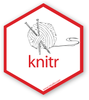
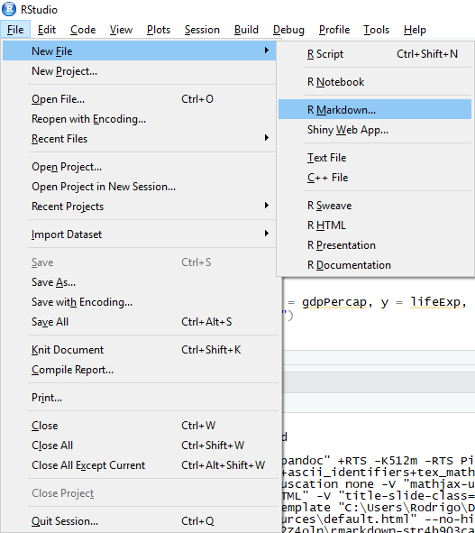
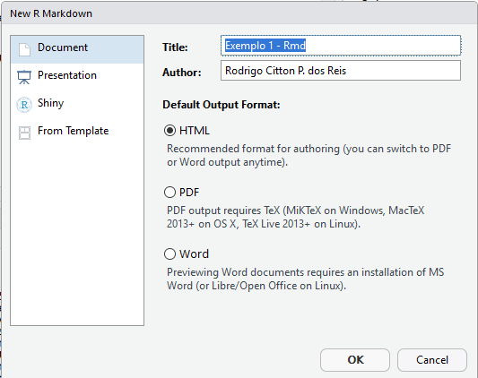
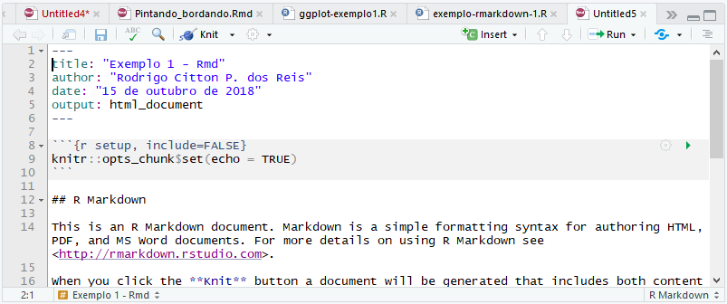
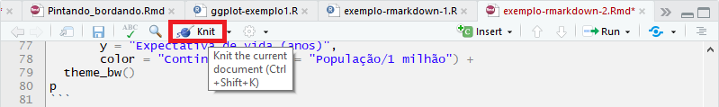
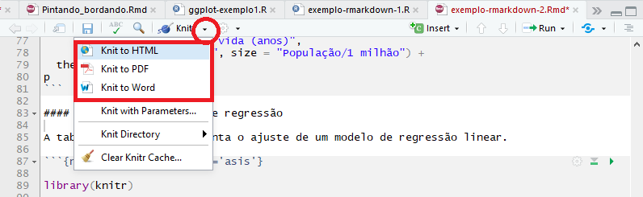

```{r setup, include=FALSE}
options(htmltools.dir.version = FALSE)
```


---
# Visão Geral

* R e Markdown  

* Comunicação Estatística  

* Pacote `rmarkdown`  

* Conceitos básicos  

* Estendendo documentos ` .Rmd `  

* Extras*


---
# O que você vai precisar

* Pacotes do R:  

  + `rmarkdown` e `knitr`, e pacotes auxiliares `diplyr`, `tidyr`;
  
  + Extras: `devtools`, `hugo`, `blogdown`, `bookdown`, `xaringan`, ....  


* Material do curso  

  + Na aba `Terminal` do RStudio digite:  
  
  `git clone https://github.com/markus-stein/Rmarkdown_workshop`  
  
  + (Slides com conceitos básicos: https://datathon-ufrgs.github.io/Pintando_e_Bordando_no_R/#1)  
  

* Guia rápido de R Markdown (Cheat Sheet)  

  + Pasta 'cheatsheet'


---
# O que é ?
### (Por que R???)

 ```{r echo=FALSE, fig.align='center', message=FALSE, warning=FALSE, out.width='30%', paged.print=FALSE}
 knitr::include_graphics('https://www.oreilly.com/library/view/the-art-of/9781593273842/httpatomoreillycomsourcenostarchimages915868.png.jpg')
 ```

### E por que RStudio?


---
# O que é Markdown?
### Por que Markdown?

> *Markdown is a text-to-HTML conversion tool for web writers. Markdown
> allows you to write using an easy-to-read, easy-to-write plain text
> format, then convert it to structurally valid XHTML (or HTML).*
>
> > John Gruber

- [Markdown] é uma [linguagem de marcação] simples para escrever
  textos  
  
- O texto pode ser lido sem nenhum processamento, ou seja, da maneira
  como está escrito  
  
- Outras linguagens de marcação como HTML e $\LaTeX$ requerem um grande
  número de *tags* para formatar o texto, muitas vezes dificultando a
  leitura do código-fonte  
  
- A proposta do Markdown é que o escritor se concentre no texto e não na
  formatação  
  
- Pode ser convertido para **vários outros formatos** além de HTML  


---
# O que é Markdown?

* Um documento Markdown possui a extensão `.md` (não a única possível)  

* Veja o arquivo de exemplo [exemplo-rmarkdown-0.md](examples/exemplo-rmarkdown-0.md)  

* Para converter um documento Markdown em HTML (ou outro formato) é necessário 
um **conversor**. 

* O Pandoc é um conversor extremamente versátil, diversos formatos, incluindo Markdown para HTML.

Se o Pandoc estiver instalado no seu sistema (Unix), converter o documento na linha de comando (Terminal) com

```{sh, eval=FALSE}
pandoc -f markdown -t html exemplo-rmarkdown-0.md -o exemplo-rmarkdown-0.html
```

O pacote `knitr` possui a função `pandoc()` que é um *wrapper* para
executar o programa `pandoc` no sistema.

```{r, eval=FALSE, message=FALSE, warning=FALSE}
# install.packages("knitr")
library(knitr)
pandoc(input = "examples/exemplo-rmarkdown-0.md", format = "html")
```

Em ambos os casos, o resultado é o arquivo [exemplo-rmarkdown-0.html](examples/exemplo-rmarkdown-0.html) no navegador.


---
# Comunicação Estatística

* Comunicação em vários sentidos  

    + teorias e metodologias entre os pares da área;  
    
    + metodologias e aplicações a outras áreas;  
    
    + comunicar resultados ao publico em geral.  
    
    
### Relatórios, artigos, livros, slides, pôster, websites, blogs, dashboards, ...

## Teoria e Prática
* Exemplo: `Teoria de prob.` + `tabelas de dists.` = `metodologia`  


---
# Comunicação Estatística

```{r, eval=FALSE}
Fisher + milionária = "Statistical Methods for Research Workers"
```


---

# Comunicação Estatística


---

# Comunicação Estatística


---

# Comunicação Estatística

## Surgimento dos computadores pessoais

  


---

# Comunicação Estatística


### Como combinar diferentes tecnologias?
* "Novos instrumentos trazem novos desafios".


---
# Comunicação Estatística

  

### Computadores falicitaram muito o nosso trabalho, mas os problemas continuam complexos. 
* Modelos e delineamentos complexos  
* Big data e aprendizado de máquinas    

---


--- 

# R e Markdown

### O pacote `rmarkdown` e a função `render()`
* A função `render()` é uma $wrapper$,   
  + internamente chama `knitr::knit()`  
  + então converte o documento para `.html` usando o Pandoc.  


### Conceitos básicos
* Slides da apresentação https://github.com/datathon-ufrgs/website
  + Prof. Rodrigo dos Reis


---

class: inverse, middle, center
background-image: url("images/rodrigo/rmarkdown.png")
background-size: contain


---

# O que é o rmarkdown<sup>1</sup>?

.pull-left[

```{r echo=FALSE, fig.align='center', message=FALSE, warning=FALSE, out.width='100%', paged.print=FALSE}

```

]

.pull-right[

```{r echo=FALSE, fig.align='center', message=FALSE, warning=FALSE, out.width='40%', paged.print=FALSE}

```

- **R** (códigos) + **Markdown** (linguagem **simples** de marcação para geração de **texto**)
    + [**Pandoc**](http://pandoc.org/) (conversor universal de documentos)

]

.footnote[
[1] Allaire, J.J., Xie, Y., McPherson, J., Luraschi, J., Ushey, K., Atkins, A., Wickham, H., Cheng, J. e Chang, W. (2018). *rmarkdown: Dynamic
  Documents for R*. R package version 1.10.
]


---

background-image: url("images/rodrigo/bandThree2.png")
background-size: cover

# O fluxo do rmarkdown?

```{r echo=FALSE, fig.align='center', message=FALSE, warning=FALSE, out.width='100%', paged.print=FALSE}
knitr::include_graphics('images/rodrigo/rmarkdownflow.png')
```

- Quando compilado, o **R Markdown** alimenta o arquivo .Rmd para **knitr**, que executa todos os fragmentos de código e cria um novo documento markdown (.md) que inclui o código e sua saída.

- O arquivo markdown gerado pelo **knitr** é então processado pelo **pandoc**⧉ que é responsável pela criação do formato final.

- Isso pode parecer complicado, mas o **R Markdown** torna extremamente simples encapsulando todo o processamento acima em uma 
única função de renderização.


---

# Por que rmarkdown?

```{r echo=FALSE, fig.align='center', message=FALSE, warning=FALSE, out.width='100%', paged.print=FALSE}

```

- Vamos a um exemplo!

---

background-image:  url("images/rodrigo/totoro_danca.gif")
background-size: cover
class: center, inverse

# Vamos lá!

---

# Instalando e carregando o rmarkdown

- Instalando o pacote **rmarkdown**

```{r echo=TRUE, eval=FALSE, message=FALSE, warning=FALSE}
install.packages("rmarkdown")
```

- Carregando o pacote **rmarkdown**

```{r echo=TRUE, eval=FALSE, message=FALSE, warning=FALSE}
library(rmarkdown)
```

---

# Criando um documento R markdown

- Clique em `File -> New File -> R Markdown`

```{r echo=FALSE, fig.align='center', message=FALSE, warning=FALSE, out.width='55%', paged.print=FALSE}

```

---

# Criando um documento R markdown

- Agora você deve ver uma caixa de diálogo como mostrado abaixo.
- Selecione "Document" no painel à esquerda e preencha o campo de título e autor e clique em "OK".

```{r echo=FALSE, fig.align='center', message=FALSE, warning=FALSE, out.width='60%', paged.print=FALSE}

```

---

# Criando um documento R markdown

- Agora você deve ter um documento que parece com isso

```{r echo=FALSE, fig.align='center', message=FALSE, warning=FALSE, out.width='100%', paged.print=FALSE}

```

---

# YAML

- Um conjunto de opções que definem o arquivo de saída

.pull-left[

- Este documento gera um arquivo `html`

```yaml
---
title: "Exemplo 1 - Rmd"
author: "Rodrigo Citton P. dos Reis"
date: "15 de outubro de 2018"
output: html_document
---
```

]

.pull-right[

- Este documento gera um arquivo `word`

```yaml
---
title: "Exemplo 1 - Rmd"
author: "Rodrigo Citton P. dos Reis"
date: "15 de outubro de 2018"
output: word_document
---
```

]

---

# Markdown: sintaxe básica

.pull-left[

```
texto simples
_italico_
__negrito__
[Datahon](https://www.ufrgs.br/datathon)
# Título 1
## Título 2
### Título 3
```

]

.pull-right[

texto simples

_italico_

__negrito__

[Datahon](https://www.ufrgs.br/datathon)

## Título 1

### Título 2

#### Título 3

]

---

# Markdown: sintaxe básica

.pull-left[

```
- Lista não ordenada
- item 2
    + sub-item 1
    + sub-item 2
1. Lista ordenada
2. item 2
    + sub-item 1
    + sub-item 2
Cabeçalho tabela | Segundo cabeçalho
---------------- | -----------------
Célula tabela    | Célula 2
Célula 3         | Célula 4
```

]

.pull-right[

- Lista não ordenada
- item 2
    + sub-item 1
    + sub-item 2
    
1. Lista ordenada
2. item 2
    + sub-item 1
    + sub-item 2

Cabeçalho tabela | Segundo cabeçalho
---------------- | -----------------
Célula tabela    | Célula 2
Célula 3         | Célula 4

]


---

# O banco de dados

- Carregando o banco de dados **gapminder**

```{r echo=TRUE, message=FALSE, warning=FALSE}
# install.packages("gapminder")
library(gapminder)
gapminder
```

---

# O banco de dados

- `gdpPercap`: **renda per capita** ("PIB/Pop").
- `lifeExp`: **expectativa de vida** ao nascer (número de anos aproximados que se espera que um grupo de indivíduos nascidos no mesmo ano irá viver).
- `year`: 1952 a 2007 em incrementos de 5 anos.

```{r echo=TRUE, message=FALSE, warning=FALSE}
# install.packages(dplyr)
library(dplyr)
gapminder <- gapminder %>%
  mutate(pop_m = pop/1e6)
gapminder07 <- gapminder %>%
  filter(year == 2007)
```

---

background-image:  url("images/rodrigo/chuky.gif")
background-size: cover
class: center, inverse

# Chunk!

---

# Chunk

- Os códigos em **R** são passados para o arquivo .Rmd por meio de fragmentos de código (_chunk codes_).
- Um exemplo de chunk:


    `r ''````{r}
    summary(gapminder07$pop_m)
    ```
- Saída:

```{r}
summary(gapminder07$pop_m)
```

---

# Chunk

    `r ''````{r, echo=FALSE}
    summary(gapminder07$pop_m)
    ```

- Saída:
```{r, echo=FALSE}
summary(gapminder07$pop_m)
```

---

# Chunk

    `r ''````{r, eval=FALSE}
    summary(gapminder07$pop_m)
    ```

- Saída:
```{r, eval=FALSE}
summary(gapminder07$pop_m)
```

---

# Chunk

    `r ''````{r, echo=FALSE, results='asis'}
    library(knitr)
    mod1 <- lm(lifeExp ~ gdpPercap, data = gapminder07)
    kable(summary(mod1)$coef, format = "html")
    ```

- Saída:
```{r, echo=FALSE, results='asis'}
library(knitr)
mod1 <- lm(lifeExp ~ gdpPercap, data = gapminder07)
kable(summary(mod1)$coef, format = "html")
```

---

background-image:  url("images/rodrigo/totoro_jumpingjack.gif")
background-size: cover
class: center, inverse

# Exercício 1!

---

1. Crie um arquivo .Rmd.
2. Acrescente texto e a análise do arquivo **exemplo-rmarkdown-1.R**
3. Clique em `knit` para gerar o arquivo de saída.

```{r echo=FALSE, fig.align='center', message=FALSE, warning=FALSE, out.width='100%', paged.print=FALSE}

```

- Experimente gerar diferentes formatos de saída.

```{r echo=FALSE, fig.align='center', message=FALSE, warning=FALSE, out.width='100%', paged.print=FALSE}

```

---

# Por que rmarkdown?

```{r echo=FALSE, fig.align='center', message=FALSE, warning=FALSE, out.width='100%', paged.print=FALSE}

```

- Reprodutibilidade
- Dinamismo
- Eficiência
- Velocidade

---

background-image:  url("images/rodrigo/totoro_bola.gif")
background-size: cover
class: center, inverse

# Um último exemplo!


---

background-image:  url("images/rodrigo/porquecomprar-v2.gif")
background-size: cover
class: center, middle, inverse

# Perguntas!?!


---

# Meus exemplos de R Markdown

* Planos de aula  
  + abra o arquivo `Exemplo_rmd_logo_PlanoAula.Rmd` na pasta `estendendo_rmd_exemplos`
  + clique no botão `knit`
  + se der erro com o LATEX tentar instalar o pacote `tinitex` do R


* Relatório técnico com `shiny`  
  + abra o arquivo `Exemplo_rmd_shiny_MCMLnotes.Rmd`
  + clique no botão `> Run Document`


* Slides com `ioslides`
  + 1º Datathon UFRGS - [](ufrgs.br/datathon)  
  + Arquivos do projeto RStudio em https://github.com/datathon-ufrgs/website


### Importante: grandes projetos necessitam maior organização!!!
* Projetos em R e `.Rproj`
* Ferramentas `Git` e `Github`?


---

# Slides - pacote `xaringan`
Autor Yiuhi Xie

```{r, eval=FALSE}
install.packages("xaringan")
```

* Crie um novo documento `xaringan` em   
`File > New File > R Markdown > From Template > Ninja Presentation {xaringan}`

Exemplo:

* Esses slides aqui!!!


---

# Curriculum - pacote `vitae`
Autor Mitchell O'Hara-Wild

```{r, eval=FALSE}
install.packages('vitae')
```


## https://github.com/mitchelloharawild/vitae


## https://docs.ropensci.org/vitae/  


---

# Artigos - pacote `rticles`
Autor Yiuhi Xie

```{r, eval=FALSE}
install.packages("rticles")
```

## https://github.com/rstudio/rticles


---

# Livros - pacote `bookdown`

Livro  
* bookdown: Authoring Books and Technical Documents with R Markdown  
  + https://bookdown.org/yihui/bookdown/


Exemplos Juliana: `bookdown` e `learnr`


---

# Websites - pacote `blogdown`

Livro  
* blogdown: Creating Websites with R Markdown  
  + https://bookdown.org/yihui/blogdown/

Github repositories: 

* https://github.com/rbind/blogdown-demo

* https://github.com/apreshill/blogdown-workshop


---

## Pôster - pacote `pagedown`

## Tutoriais - pacote `learnr`

## Provas - pacote `rexams`


---

# Referências (e eventos)

* Workshop UseR!2019 - https://github.com/rstudio-education/communicate-rmd-workshop    
  + Datathon (Rmarkdown + Shiny): https://user2019.r-project.org/datathon/
  + Winner's work: https://user2019.r-project.org/static/uploads/winner_datathon2019.html

* Rstudio Conf 2019 - https://github.com/dtkaplan/shinymark

* https://datathon-ufrgs.github.io/Pintando_e_Bordando_no_R/#1

* http://cursos.leg.ufpr.br/prr/capMarkdown.html#escrevendo_um_documento_em_markdown

* curso-r


---

# Thanks!


## https://github.com/markus-stein/Rmarkdown_workshop


## markus.stein@ufrgs.br

